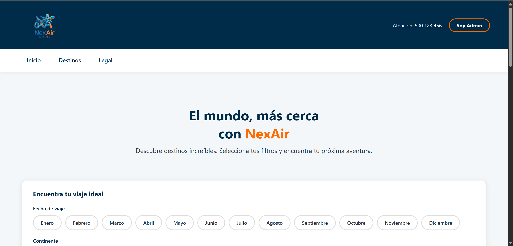
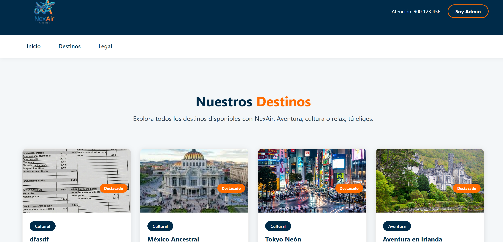
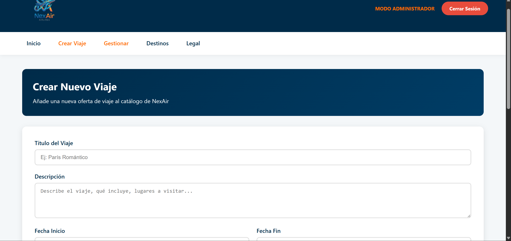
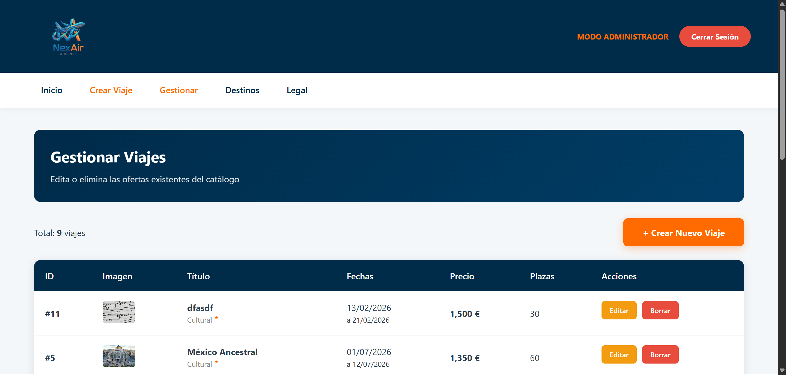
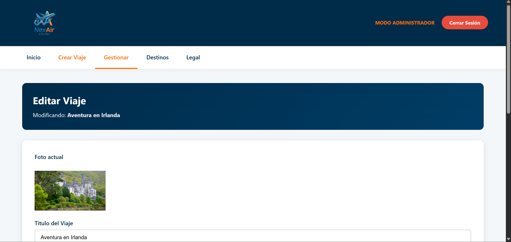

# NexAir

**Aplicación web de gestión de ofertas turísticas**

Esta plataforma permite administrar viajes y promociones. Fue desarrollada
como proyecto para la asignatura de Sistema de Gestion Empresarial, utilizando PHP, MySQL
(y XAMPP como servidor local) y una estructura MVC ligera.

---

## Datos del alumno

- **Nombre:** Liberto Guillén Álvarez

---

## Requisitos previos

- Servidor web con PHP 7.4+ (XAMPP recomendado).
- MySQL/MariaDB.
- Navegador moderno.

---

## Instalación rápida

1. **Clonar el repositorio**
   ```bash
   git clone https://github.com/tu_usuario/NexAir.git
   cd NexAir
   ```
2. **Copiar los archivos** a la carpeta `htdocs` de XAMPP:
   ```txt
   C:\xampp\htdocs\NexAir
   ```
3. Iniciar **Apache** y **MySQL** desde el panel de control de XAMPP.
4. Importar la base de datos ejecutando el script SQL:
   ```sql
   -- desde phpMyAdmin o la consola mysql
   SOURCE sql/database_schema.sql;
   ```
5. Ajustar los parámetros de conexión en `app/clases/conexion.php` si
   fuera necesario (usuario, contraseña, nombre de base de datos).
6. Abrir la aplicación en el navegador:
   `http://localhost/NexAir/public/index.php`.

---

## Credenciales de administrador iniciales

Estas credenciales se generan mediante el script `sql/crear_admin.php`.

- **Usuario:** `javier`
- **Contraseña:** `nexair2026`

> Modifique o elimine estas credenciales en producción.

---

## Uso básico

- **Inicio:** pantalla pública con listado de viajes.
- **Detalle:** ver información extendida de cada oferta.
- **Login:** acceso de administrador para crear/editar/borrar viajes.
- **Panel admin:** añadir nuevas ofertas, editar existentes y gestionar
  imágenes.

---

## Capturas de pantalla

A continuación se muestran las pantallas principales. Las imágenes deben
colocarse en la carpeta `assets/screenshots/` con los nombres indicados;
GitHub las renderizará automáticamente.

### Página de inicio



### Lista de ofertas



### Crear



### Gestionar



### Editar



---

## Autor y créditos

- **Desarrollado por:** Liberto Guillén Álvarez
- Proyecto académico para la asignatura de Sistema de Gestion Empresarial.

---
